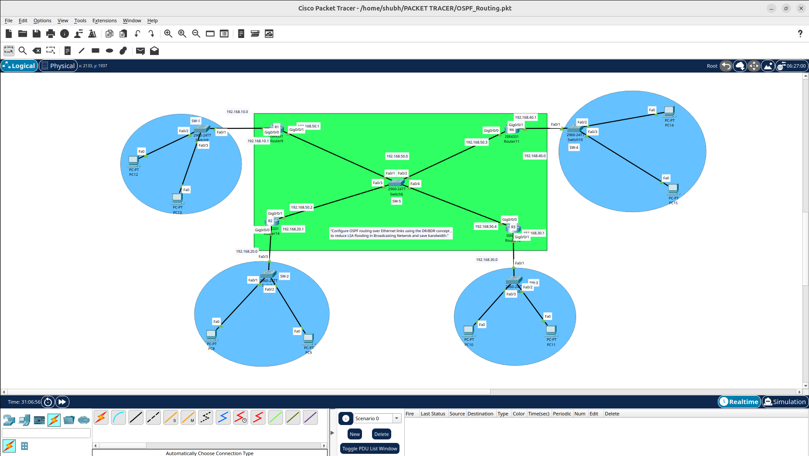
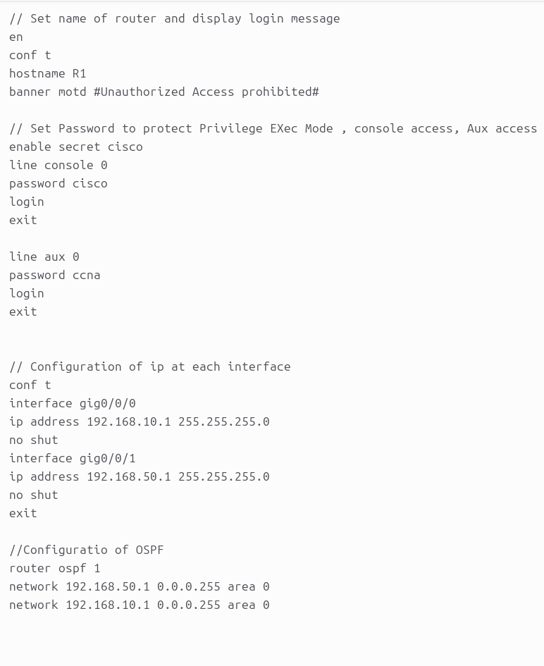
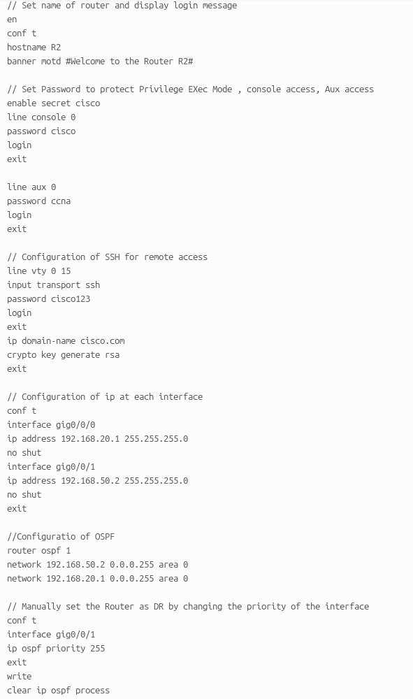
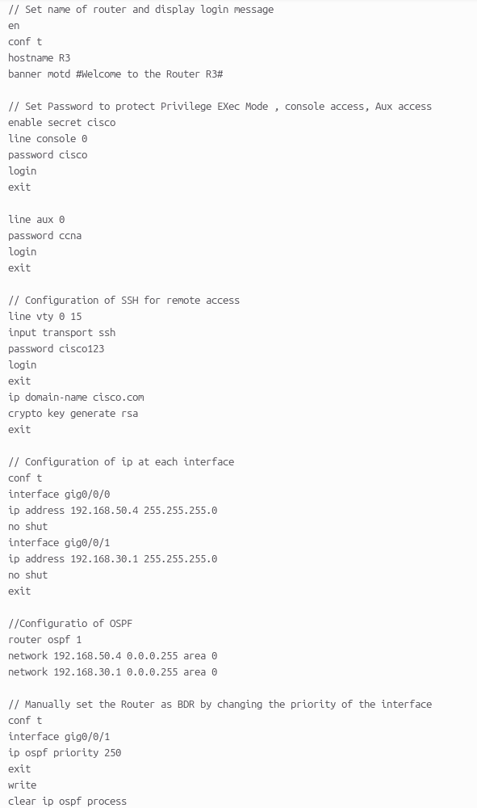
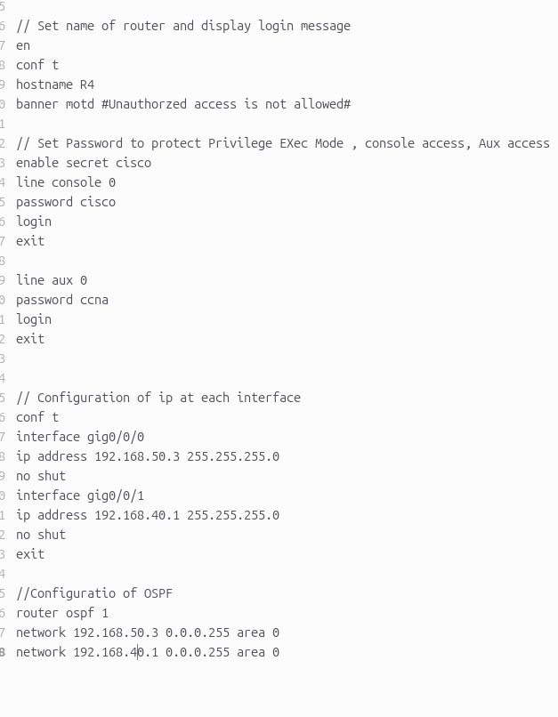
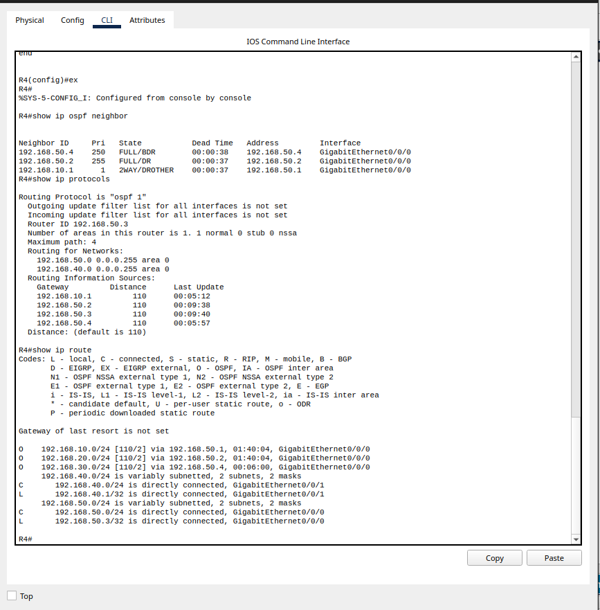

# Implementation-of-OSPF-Routing-with-DR-BDR-Election-and-Network-Security
Implemented OSPF routing in a multi-router network using Cisco Packet Tracer. Configured DR and BDR election to optimize routing updates and reduce network overhead. Enabled SSH for secure remote access and secured router management with passwords. Demonstrated OSPF neighbor formation, route exchange, and basic network security.
## Network Topology

## Configuration

## CLI

